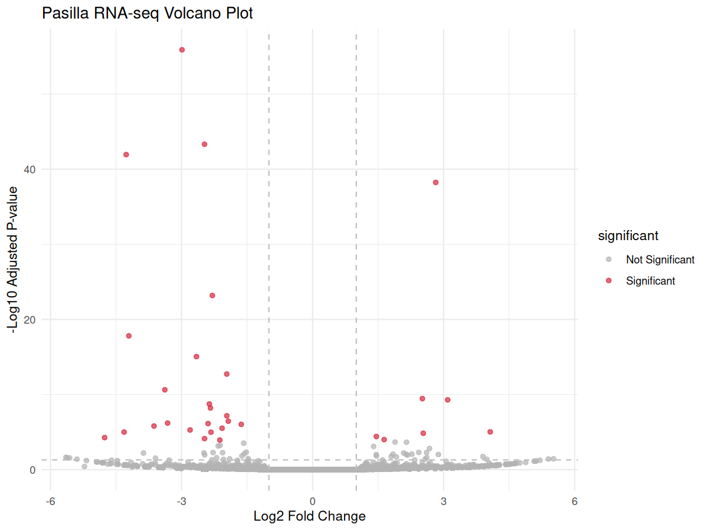
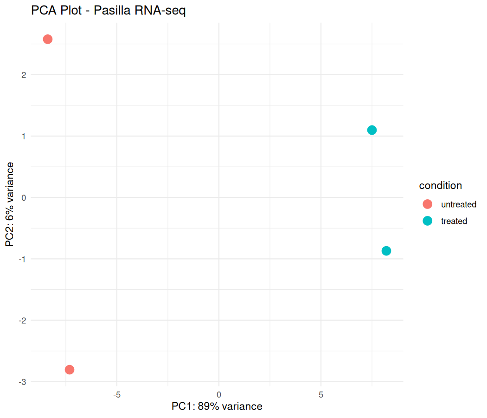
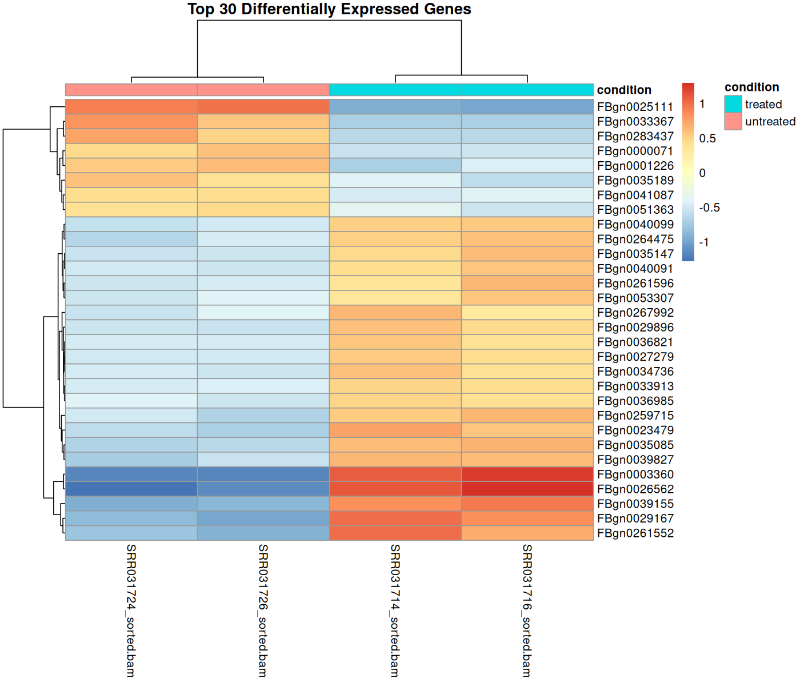
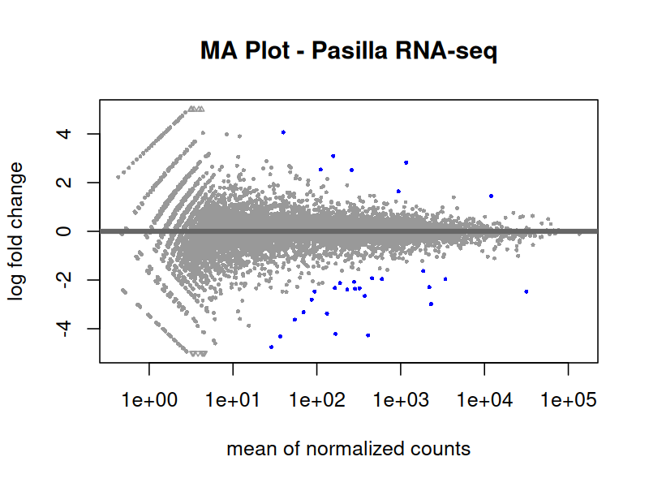

# Pasilla RNA-seq Analysis

End-to-end RNA-seq differential expression analysis of the *Drosophila melanogaster* Pasilla dataset using FastQC, fastp, HISAT2, SAMtools, featureCounts and DESeq2.

---

## Overview

This project demonstrates a complete RNA-seq workflow starting from raw sequencing reads and ending with differential gene expression analysis.

The analysis was performed on Ubuntu Linux using standard bioinformatics tools and R/Bioconductor packages.

---

## Dataset

* Organism: *Drosophila melanogaster*
* Dataset: Pasilla RNA-seq dataset
* Experimental Conditions:

  * Treated (2 samples)
  * Untreated (2 samples)

---

## Workflow

1. Quality Control (FastQC)
2. Read Trimming (fastp)
3. Genome Alignment (HISAT2)
4. BAM Processing (SAMtools)
5. Read Quantification (featureCounts)
6. Differential Expression Analysis (DESeq2)
7. Visualization and Interpretation

---

## Results Summary

After filtering low-expression genes:

| Metric                  | Value |
| ----------------------- | ----- |
| Total genes analyzed    | 9868  |
| Upregulated genes       | 364   |
| Downregulated genes     | 404   |
| Total significant genes | 768   |

High-confidence differentially expressed genes:

* Adjusted p-value < 0.05
* |Log2 Fold Change| > 1

**Significant genes identified: 167**

---

## Visualizations

### Volcano Plot



### PCA Plot



### Heatmap



### MA Plot



---

## Repository Structure

```text
results/
├── DESeq2_results.csv
├── pasilla_counts.txt
├── pasilla_counts.txt.summary
├── volcano_plot.png
├── PCA_plot.png
├── Heatmap.png
├── MA_plot.png
├── Top20_DEGs.csv
└── Significant_Genes.csv
```

---

## Software and Tools

* FastQC
* fastp
* HISAT2
* SAMtools
* featureCounts
* R
* DESeq2

---

## Key Outputs

* Gene count matrix
* Read assignment summary
* Differential expression results
* Significant gene list
* Top 20 differentially expressed genes
* Publication-quality visualizations

---

## Author

**Sumit Sharma**

M.Sc. Bioinformatics

GitHub: https://github.com/SumitSharmaHp

---

## Citation

### Dataset

Brooks AN, Yang L, Duff MO, Hansen KD, Park JW, Dudoit S, Brenner SE, Graveley BR. (2011).

**Conservation of an RNA regulatory map between Drosophila and mammals.**

Genome Research, 21(2), 193–202.

DOI: https://doi.org/10.1101/gr.108662.110

---

### HISAT2

Kim D, Paggi JM, Park C, Bennett C, Salzberg SL. (2019).

**Graph-based genome alignment and genotyping with HISAT2 and HISAT-genotype.**

Nature Biotechnology, 37, 907–915.

DOI: https://doi.org/10.1038/s41587-019-0201-4

---

### featureCounts

Liao Y, Smyth GK, Shi W. (2014).

**featureCounts: an efficient general-purpose program for assigning sequence reads to genomic features.**

Bioinformatics, 30(7), 923–930.

DOI: https://doi.org/10.1093/bioinformatics/btt656

---

### DESeq2

Love MI, Huber W, Anders S. (2014).

**Moderated estimation of fold change and dispersion for RNA-seq data with DESeq2.**

Genome Biology, 15(12), 550.

DOI: https://doi.org/10.1186/s13059-014-0550-8
